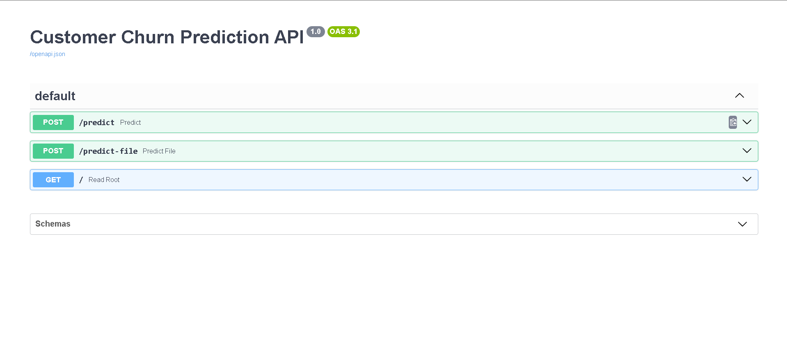
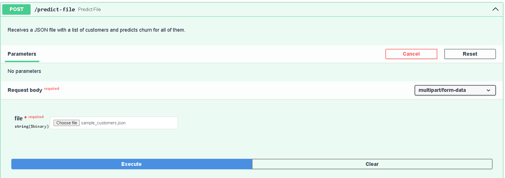
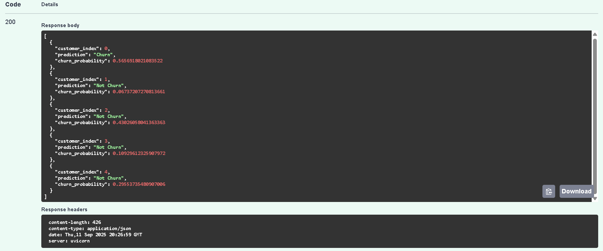

# End-to-End Customer Churn Prediction API

This project is a complete end-to-end machine learning pipeline that predicts customer churn. The pipeline includes data cleaning, model training, and deployment as a REST API using Docker.

## Tech Stack 🛠️

- **Data Analysis & Cleaning**: Pandas, NumPy
- **Model Training**: Scikit-learn, LightGBM
- **API Development**: FastAPI
- **Containerization**: Docker
- **Deployment**: Designed for cloud services like AWS App Runner

## Screenshots

### 1. Interactive API Documentation
The API is automatically documented using Swagger UI, available at the `/docs` endpoint.



### 2. Batch Prediction with File Upload
The `/predict-file` endpoint allows for predicting churn on a batch of customers by uploading a JSON file.



### 3. Prediction Output
A successful request returns a JSON object with the prediction and churn probability for each customer in the uploaded file.



## Project Structure

```
├── api/                  # Contains all files for the production API
│   ├── main.py           # FastAPI application script
│   ├── Dockerfile        # Instructions to build the Docker image
│   ├── requirements.txt  # Python dependencies for the API
│   ├── churn_model.joblib  # Trained LightGBM model
│   └── ...
│
├── .gitignore            # Specifies files for Git to ignore
├── 1_Model_Training_and_Analysis.ipynb  # Jupyter Notebook with EDA and model training
└── README.md             # This file
```

## How to Run Locally

To run this project, you need to have Docker installed and running on your machine.

1.  **Clone the repository:**
    ```bash
    git clone [https://github.com/madonis04/Churn-Prediction.git](https://github.com/Madonis04/Churn-Prediction.git)
    cd Churn-Prediction
    ```

2.  **Navigate to the API directory:**
    ```bash
    cd api
    ```

3.  **Build the Docker image:**
    ```bash
    docker build -t churn-api .
    ```

4.  **Run the Docker container:**
    ```bash
    docker run -p 8080:80 churn-api
    ```

5.  **Access the API:** The API is now running. You can access the interactive documentation at **[http://localhost:8080/docs](http://localhost:8080/docs)**.

## API Endpoints

The application exposes the following endpoints:

| Method | Endpoint | Description |
| :--- | :--- | :--- |
| `POST` | `/predict` | Predicts churn for a single customer. Expects a JSON payload. |
| `POST` | `/predict-file`| Predicts churn for a batch of customers from an uploaded JSON file. |